# CARDIFF METROPOLITAN UNIVERSITY / ICBT CAMPUS
## SCHOOL OF TECHNOLOGIES
### MODULE: CMP 7001 – ADVANCED PROGRAMMING
---
# ACADEMIC COURSEWORK REPORT (PRAC 1)
## DESIGN, ARCHITECTURE, AND EMPIRICAL EVALUATION OF AN OBJECT-ORIENTED MANAGEMENT PROTOTYPE FOR THE INTELLIGENT WELLNESS AND FITNESS CENTER (IWFC)

**Academic Year:** 2025/2026 | **Semester:** Semester 1  
**Module Leader:** royian11@gmail.com  
**Assessment Nature:** PRAC 1 – Practical Project (75% Weighting)  
**Target Word Count:** ~3,000 Words  
**Submission Format:** PDF (Turnitin via Cardiff Met Moodle) & Word Document (ICBT SIS Portal)  

---

### Student Declaration
*I certify that the attached material is my original work. No other person’s work or ideas have been used without acknowledgement. Except where I have clearly stated that I have used some of this material elsewhere, I have not presented it for examination / assessment in any other course or unit at this or any other institution.*

---

## Executive Summary

The modern health and fitness sector is undergoing a rapid paradigm shift driven by digital transformation and Internet-of-Things (IoT) telemetry. Traditional fitness centers struggle with fragmented manual administrative procedures, uncoordinated equipment servicing, and brittle session reservation channels. This coursework presents the architectural conception, software design, object-oriented implementation, and empirical verification of a unified management system prototype engineered for the **Intelligent Wellness and Fitness Center (IWFC)**. 

Developed in modern Java (LTS 21/22), the prototype fulfills the core enterprise requirements of three primary actor classifications: Administrators, Instructors, and Members. The underlying architecture addresses three operational domains: (1) predictive equipment wear monitoring and inventory lifecycle control, (2) double-booking-resilient session scheduling with recurring weekly class generation, and (3) closed-loop maintenance incident reporting with multi-channel asynchronous observer alerting. 

The software system applies the five core Object-Oriented Programming (OOP) paradigms (Abstraction, Encapsulation, Inheritance, Polymorphism, and Reusability) in conjunction with modern Java constructs, including bounded generic repositories and the Java Collections Framework (`Map`, `List`, `Set`). To achieve structural decoupling and maintainability, five Gang-of-Four (GoF) design patterns are integrated: the Factory Method and Builder patterns (Creational), the Facade pattern (Structural), and the Observer and Strategy patterns (Behavioural). System resilience and application security are enforced through a custom checked exception hierarchy that guarantees Role-Based Access Control (RBAC) integrity and domain boundary protection. The system's correctness is validated via an automated JUnit 5 test harness comprising 26 unit and integration test suites, alongside an end-to-end automated simulation bot reproducing complex actor interactions and boundary conditions.

---

## Table of Contents
1. **Introduction and Problem Domain Analysis**
   - 1.1 Organizational Background & Digital Transformation Rationale
   - 1.2 Stakeholder Identification & Functional Requirements
   - 1.3 Scope Boundaries and Non-Functional Engineering Constraints
2. **System Architecture and High-Level Design**
   - 2.1 Architectural Tiering and Separation of Concerns
   - 2.2 Domain Class Diagram & Structural Topography
   - 2.3 Role-Based Security & Access Control Infrastructure
3. **Critical Evaluation of Object-Oriented Principles & Advanced Constructs**
   - 3.1 Abstraction and Separation of Contract from Realization
   - 3.2 Information Hiding and Data Encapsulation
   - 3.3 Class Hierarchies and Inheritance Taxonomy
   - 3.4 Runtime Polymorphism & Dynamic Dispatch Mechanics
   - 3.5 Type-Safe Generics and Java Collections Framework Evaluation
4. **Design Patterns Implementation & Theoretical Justification**
   - 4.1 Creational Patterns: Factory Method & Fluent Builder
   - 4.2 Structural Pattern: Unified System Facade
   - 4.3 Behavioural Patterns: Observer Event Infrastructure & Interchangeable Validation Strategy
   - 4.4 Architectural Trade-Offs and Alternative Patterns Evaluated
5. **Secure Software Construction & Robust Custom Exception Handling**
   - 5.1 Defensive Programming and Design-by-Contract
   - 5.2 Custom Exception Hierarchy and Fault Classification
   - 5.3 Exception Propagation and Failure Recovery Pathways
6. **Verification, Unit Testing, and Empirical Results**
   - 6.1 Automated Testing Methodology & JUnit 5 Architecture
   - 6.2 Unit Test Execution Matrix & Boundary Case Analysis
   - 6.3 Negative Robustness Verification (Intentional Failing Tests)
   - 6.4 Automated End-to-End Simulation Bot Execution
7. **Critical Reflection, Limitations, and Future Enhancements**
   - 7.1 Cardiff Met EDGE Attribute Analysis
   - 7.2 Technical Limitations & In-Memory Volatility
   - 7.3 Concurrency, Distributed Scaling, and Persistence Migration Plan
8. **Conclusion**
9. **References**

---

## 1. Introduction and Problem Domain Analysis

### 1.1 Organizational Background & Digital Transformation Rationale
Commercial fitness facilities operate in an environment characterized by heavy equipment utilization, rapid asset degradation, and time-critical customer engagement (Hurley, 2020). The Intelligent Wellness and Fitness Center (IWFC) operates multiple specialized exercise zones (Cardio Zone, Functional Strength Zone, and Dedicated Group Class Studios). Historically, IWFC relied on disconnected paper logs, ad-hoc whiteboards, and manual booking spreadsheets. 

This fragmented operational model manifested three major organizational liabilities:
1. **Unpredictable Asset Downtime:** Equipment failures (e.g., electronic resistance motor failures on spin bikes or treadmill drive belt slipping) were reported reactively only after member complaints. Lack of cumulative usage tracking led to unexpected breakdowns during peak operating hours.
2. **Scheduling Collisions:** Studio rooms and high-demand specialized apparatus suffered frequent double-bookings, leading to instructor conflicts and member dissatisfaction.
3. **Communication Latency:** Maintenance handovers between instructors and facility administrative staff lacked traceability, creating unmonitored ticket backlogs and safety hazards.

To resolve these liabilities, IWFC initiated a digital transformation initiative to engineer an enterprise-grade Java management tool. The software must replace ad-hoc administrative processes with an automated system governed by strict business logic, compile-time type safety, and clear separation of responsibilities.

### 1.2 Stakeholder Identification & Functional Requirements
A comprehensive requirements analysis identified three core human actors whose operational responsibilities dictate system interactions:

```
+-----------------------------------------------------------------------------------+
|                                IWFC ACTOR TAXONOMY                                |
+-----------------------------------------------------------------------------------+
|  ACTOR          | PRIMARY BUSINESS RESPONSIBILITIES                               |
+-----------------+-----------------------------------------------------------------+
|  Administrator  | • Equipment asset registration, modification, decommissioning   |
|                 | • Preventative maintenance threshold calibration & monitoring   |
|                 | • Global maintenance ticket oversight, assignment, resolution   |
|                 | • System-wide user registry and security access audits          |
+-----------------+-----------------------------------------------------------------+
|  Instructor     | • Fitness class session creation (HIIT, Yoga, Pilates, Spin)   |
|                 | • Equipment reservation and studio space allocation             |
|                 | • Recurring weekly session series planning                      |
|                 | • Equipment defect and mechanical breakdown reporting           |
+-----------------+-----------------------------------------------------------------+
|  Member         | • Timetable inspection and real-time slot availability checking |
|                 | • Class reservation booking and booking cancellation            |
|                 | • Automated reservation and wellness schedule notifications     |
+-----------------+-----------------------------------------------------------------+
```

#### Detailed Functional Requirements
1. **Equipment Tracking & Preventative Alerting:**
   - Administrators must register new physical assets with unique alphanumeric identifiers, equipment types (`Treadmill`, `SpinBike`, `RowingMachine`), and physical studio locations.
   - The system must accumulate operating hours logged by automated workout telemetry or staff logs.
   - When cumulative operating hours cross calibrated maintenance thresholds (e.g., 200 hours for treadmills, 150 hours for spin bikes), the system must raise automated preventative maintenance alerts.
2. **Session Scheduling & Collision Prevention:**
   - Instructors must schedule group fitness sessions with defined time windows, instructor assignments, capacity limits, and required equipment.
   - The scheduling engine must enforce hard boundaries: facility opening hours (06:00 to 22:00), zero studio room overlap, and zero equipment allocation conflicts.
   - The system must support recurring weekly sessions, generating future session dates automatically.
3. **Maintenance Incident Workflow:**
   - Instructors must lodge equipment faults with urgency levels (`Low`, `Medium`, `High`, `Critical`).
   - Logging a fault must mark the physical equipment status as `Faulty`, rendering it unbookable for future classes.
   - The maintenance lifecycle must enforce discrete state transitions: `Pending` $\rightarrow$ `Assigned` (marking equipment `Under Maintenance`) $\rightarrow$ `Completed` (restoring equipment to `Operational` and zeroing cumulative usage hours).
   - All state transitions must notify relevant stakeholders via an automated observer event stream.

### 1.3 Scope Boundaries and Non-Functional Engineering Constraints
Per the CMP 7001 assessment brief, the prototype focuses on domain logic rigor, object-oriented design patterns, generic data structures, and custom exception resilience. Data persistence utilizes an in-memory repository architecture backed by thread-safe Java Collections; an external relational database is explicitly out of scope for the prototype phase. The user interface is implemented as a role-based interactive console menu. Excellence is evaluated on architectural cohesion, strict adhering to object-oriented principles, and comprehensive verification.

---

## 2. System Architecture and High-Level Design

### 2.1 Architectural Tiering and Separation of Concerns
The IWFC prototype employs a decoupled, multi-tier software architecture adhering to the Single Responsibility Principle (Martin, 2018). The system is partitioned into six cohesive layers:

```
+-------------------------------------------------------------------+
|                        PRESENTATION LAYER                         |
|   ConsoleMenu (CLI Interface)   |   DemoBot (Automated Test Bot)  |
+-------------------------------------------------------------------+
                                  │
                                  ▼
+-------------------------------------------------------------------+
|                     FACADE / ORCHESTRATION LAYER                  |
|                 IWFCSystemFacade (Unified Entry Point)             |
+-------------------------------------------------------------------+
                                  │
                                  ▼
+-------------------------------------------------------------------+
|                         SERVICE LAYER                             |
|  AuthService  |  EquipmentService  |  SchedulingService  |  Maint. |
+-------------------------------------------------------------------+
         │                                       │
         ▼                                       ▼
+-----------------------+              +----------------------------+
|  DESIGN PATTERNS      |              |      DATA ACCESS LAYER     |
|  • EquipmentFactory   |              |  Repository<T, ID>         |
|  • SessionBuilder     |              |  InMemoryRepository<T, ID> |
|  • NotificationSubj.  |              +----------------------------+
|  • ValidationStrategy |                            │
+-----------------------+                            ▼
                                       +----------------------------+
                                       |        DOMAIN LAYER        |
                                       |  User (Admin/Ins/Member)   |
                                       |  Equipment (TM/Bike/Rower) |
                                       |  FitnessSession, Booking   |
                                       |  MaintenanceRequest        |
                                       +----------------------------+
```

1. **Domain Layer (`com.iwfc.model`):** Encapsulates core business entities, life-cycle enumerations, and polymorphic domain behavior.
2. **Data Access Layer (`com.iwfc.repository`):** Provides a generic abstraction over entity storage using parameterized interfaces and in-memory collections.
3. **Design Pattern Infrastructure (`com.iwfc.pattern`):** Encapsulates creational, structural, and behavioural GoF pattern implementations.
4. **Service Layer (`com.iwfc.service`):** Contains application business rules, transactional logic, lifecycle workflows, and security role checks.
5. **Facade Layer (`com.iwfc.pattern.structural`):** Aggregates underlying service interactions into a single access point, enforcing Role-Based Access Control.
6. **Presentation Layer (`com.iwfc.ui` & `com.iwfc.bot`):** Dispatches user requests to the facade and formats domain results for console rendering.

### 2.2 Domain Class Diagram & Structural Topography
The system’s static structure is captured in the UML class diagram below, illustrating inheritance hierarchies, generic interface realizations, and pattern relationships:

```mermaid
classDiagram
    %% Common
    class Identifiable~ID~ {
        <<interface>>
        +getId() ID
    }

    %% User Hierarchy
    class User {
        <<abstract>>
        -String id
        -String name
        -String email
        -UserRole role
        +getId() String
        +getName() String
        +getRole() UserRole
        +getDashboardSummary()* String
    }
    Identifiable <|.. User
    User <|-- Admin
    User <|-- Instructor
    User <|-- Member

    class Admin {
        -String department
        +getDashboardSummary() String
    }
    class Instructor {
        -String specialization
        +getDashboardSummary() String
    }
    class Member {
        -String membershipTier
        +getDashboardSummary() String
    }

    %% Equipment Hierarchy
    class Equipment {
        <<abstract>>
        -String id
        -String name
        -EquipmentType type
        -EquipmentStatus status
        -String location
        -double cumulativeUsageHours
        -double maintenanceThresholdHours
        +logUsage(double hours)
        +isMaintenanceDue() boolean
        +resetMaintenanceCycle() void
        +calculateWearIndex()* double
    }
    Identifiable <|.. Equipment
    Equipment <|-- Treadmill
    Equipment <|-- SpinBike
    Equipment <|-- RowingMachine

    class Treadmill {
        -double maxInclineGrade
        +calculateWearIndex() double
    }
    class SpinBike {
        -boolean magneticResistanceEnabled
        +calculateWearIndex() double
    }
    class RowingMachine {
        -int damperSetting
        +calculateWearIndex() double
    }

    %% Scheduling & Maintenance
    class FitnessSession {
        -String id
        -String title
        -SessionType sessionType
        -String studioLocation
        -String instructorId
        -LocalDateTime startTime
        -LocalDateTime endTime
        -int maxCapacity
        -List~String~ requiredEquipmentIds
        -boolean recurring
        +overlapsWith(LocalDateTime, LocalDateTime) boolean
    }
    Identifiable <|.. FitnessSession

    class Booking {
        -String id
        -String sessionId
        -String memberId
        -LocalDateTime bookingTime
        -BookingStatus status
        +isActive() boolean
    }
    Identifiable <|.. Booking

    class MaintenanceRequest {
        -String id
        -String equipmentId
        -String reportedByInstructorId
        -String assignedToAdminId
        -MaintenanceUrgency urgency
        -MaintenanceStatus status
        +assignTo(String adminId) void
        +complete(String notes) void
    }
    Identifiable <|.. MaintenanceRequest

    %% Generic Repositories
    class Repository~T, ID~ {
        <<interface>>
        +save(T entity) T
        +update(T entity) T
        +findById(ID id) Optional~T~
        +findAll() List~T~
        +deleteById(ID id) boolean
    }
    class InMemoryRepository~T, ID~ {
        -Map~ID, T~ storage
    }
    Repository <|.. InMemoryRepository

    %% Patterns & Facade
    class IWFCSystemFacade {
        -AuthService authService
        -EquipmentService equipmentService
        -SchedulingService schedulingService
        -MaintenanceService maintenanceService
        +login(String userId) User
        +registerEquipment(...) Equipment
        +scheduleSession(FitnessSession) FitnessSession
        +bookSession(String sessionId) Booking
        +reportEquipmentFault(...) MaintenanceRequest
        +assignMaintenanceTicket(...) MaintenanceRequest
        +completeMaintenanceTicket(...) MaintenanceRequest
    }
    IWFCSystemFacade o-- Repository
```



### 2.3 Role-Based Security & Access Control Infrastructure
Security in enterprise applications requires strict enforcement of the Principle of Least Privilege (Saltzer & Schroeder, 1975). In IWFC, security is implemented at the Facade and Service boundaries via `AuthService`. Each user identity is mapped to a `UserRole` enumeration (`ADMIN`, `INSTRUCTOR`, `MEMBER`). 

When an operation is executed on `IWFCSystemFacade`, the calling context's authenticated identity is checked:
```java
public void requireRole(UserRole requiredRole) throws UnauthorizedAccessException {
    if (currentUser == null) {
        throw new UnauthorizedAccessException("Access denied: No active user session. Please log in.");
    }
    if (currentUser.getRole() != requiredRole) {
        throw new UnauthorizedAccessException(String.format(
            "Access denied: Operation requires [%s] role, but current user '%s' holds [%s] role.",
            requiredRole.getDisplayName(), currentUser.getName(), currentUser.getRole().getDisplayName()
        ));
    }
}
```
If a Member invokes `getGlobalMaintenanceLog()`, the system rejects the operation and throws an `UnauthorizedAccessException`, protecting sensitive operational records.

---

## 3. Critical Evaluation of Object-Oriented Principles & Advanced Constructs

### 3.1 Abstraction and Separation of Contract from Realization
Abstraction simplifies complex realities by separating essential behavioral contracts from operational implementation details (Gamma et al., 1994). In IWFC, abstraction is applied at two primary levels:
1. **Generic Entity Identification:** The `Identifiable<ID>` interface establishes a universal contract for any domain object possessing a key identifier. This enables generic repositories to operate on domain entities without coupling to concrete implementations.
2. **Domain Abstraction via Base Classes:** The `Equipment` class defines an abstract model of physical gym machinery. It encapsulates core properties (ID, status, location, usage meters) and declares the abstract method `calculateWearIndex()`. Callers interact with machines through the `Equipment` contract, while concrete mechanical wear calculations remain encapsulated within machine-specific subclasses.

### 3.2 Information Hiding and Data Encapsulation
Encapsulation safeguards internal object state by restricting direct variable manipulation and enforcing domain invariant validation within accessor and mutator methods (Bloch, 2018). All domain entity fields in IWFC are declared with `private` access modifiers. 

For example, within `FitnessSession`, time-boundary validation prevents temporal inconsistencies at construction:
```java
if (!endTime.isAfter(startTime)) {
    throw new IllegalArgumentException("Session end time must be after start time.");
}
if (maxCapacity <= 0) {
    throw new IllegalArgumentException("Capacity must be greater than zero.");
}
```
Furthermore, internal collection references (such as `requiredEquipmentIds`) are exposed exclusively via unmodifiable wrappers (`Collections.unmodifiableList(requiredEquipmentIds)`), preventing client code from bypassing scheduling validation rules.

### 3.3 Class Hierarchies and Inheritance Taxonomy
Inheritance facilitates code reuse and models subtype relationships (Liskov & Wing, 1994). IWFC establishes two distinct inheritance hierarchies:
1. **User Taxonomy:** Abstract class `User` establishes the foundational identity state (ID, name, email, role). Subclasses `Admin`, `Instructor`, and `Member` extend this base with role-specific attributes (`department`, `specialization`, and `membershipTier`).
2. **Equipment Taxonomy:** Abstract class `Equipment` provides core physical machinery tracking. Subclasses `Treadmill`, `SpinBike`, and `RowingMachine` extend the base with mechanical parameters (incline motor grades, magnetic flywheel settings, and cable damper resistances).

### 3.4 Runtime Polymorphism & Dynamic Dispatch Mechanics
Polymorphism allows specialized subtypes to override inherited base behavior while enabling client code to operate uniformly against superclass references (Meyer, 1997). In IWFC, dynamic method dispatch is highlighted in the mechanical wear index calculation.

Because exercise equipment degrades under different mechanical stresses, each subclass defines its own strain model:
$$\text{BaseWear} = \frac{\text{CumulativeHours}}{\text{ThresholdHours}}$$
- **`Treadmill`:** Incorporates motor heating and belt friction under incline strain:
  $$\text{Wear}_{\text{Treadmill}} = \text{BaseWear} \times 1.15$$
- **`SpinBike`:** Accounts for high-cadence flywheel resistance cycles:
  $$\text{Wear}_{\text{SpinBike}} = \text{BaseWear} \times 1.05$$
- **`RowingMachine`:** Reflects recoil spring damper and drive chain tension:
  $$\text{Wear}_{\text{RowingMachine}} = \text{BaseWear} \times 1.10$$

Client inventory components evaluate equipment health polymorphically:
```java
for (Equipment eq : equipmentRepository.findAll()) {
    double wearPercentage = eq.calculateWearIndex() * 100.0;
    // Dispatches polymorphically to Treadmill, SpinBike, or RowingMachine
}
```
This design complies with the Open/Closed Principle (Martin, 2018): introducing new equipment types (e.g., `EllipticalTrainer`) requires zero alterations to existing inventory reporting code.

### 3.5 Type-Safe Generics and Java Collections Framework Evaluation
Java Generics ensure compile-time type safety, eliminating runtime `ClassCastException` failures and redundant type casting (Bloch, 2018). In IWFC, generics are implemented in the data access layer:
```java
public interface Repository<T extends Identifiable<ID>, ID> {
    T save(T entity) throws DuplicateDataException;
    T update(T entity) throws EntityNotFoundException;
    Optional<T> findById(ID id);
    List<T> findAll();
    boolean deleteById(ID id);
    boolean existsById(ID id);
}
```
The bounded type parameter `<T extends Identifiable<ID>, ID>` ensures that only domain entities exposing an identifier can be managed by the repository.

#### Collections Evaluation
The generic repository implementation `InMemoryRepository<T, ID>` leverages the Java Collections Framework to balance memory consumption and algorithmic complexity:
- **`Map<ID, T> storage = Collections.synchronizedMap(new LinkedHashMap<>())`:**
  - *Retrieval by Key (`findById`):* Operates in $\mathcal{O}(1)$ average time complexity via hash-bucket indexing.
  - *Insertion (`save`) & Key Lookup (`existsById`):* Operates in $\mathcal{O}(1)$ time.
  - *Order Preservation:* `LinkedHashMap` maintains deterministic insertion order, ensuring consistent reporting across CLI menus and test fixtures.
  - *Thread-Safety:* Wrapping the map with `Collections.synchronizedMap` synchronizes access across parallel execution threads.
- **`List<T> findAll()`:** Returns a defensive snapshot copy (`new ArrayList<>(storage.values())`) in $\mathcal{O}(n)$ time, preventing `ConcurrentModificationException` when callers iterate while records are concurrently added.

---

## 4. Design Patterns Implementation & Theoretical Justification

To address PRAC 1 requirements, the IWFC prototype integrates five Gang-of-Four design patterns across all three design pattern classifications (Gamma et al., 1994).

```
+---------------------------------------------------------------------------------------+
|                         IWFC DESIGN PATTERNS SPECIFICATION                            |
+---------------------------------------------------------------------------------------+
| CATEGORY    | PATTERN NAME       | IMPLEMENTING CLASSES        | ARCHITECTURAL UTILITY |
+-------------+--------------------+-----------------------------+-----------------------+
| Creational  | Factory Method     | EquipmentFactory            | Encapsulates subtype  |
|             |                    |                             | instantiation         |
|             | Fluent Builder     | SessionBuilder              | Step-by-step complex  |
|             |                    |                             | object construction   |
+-------------+--------------------+-----------------------------+-----------------------+
| Structural  | Facade             | IWFCSystemFacade            | Unified simplified API|
|             |                    |                             | shielding subsystems  |
+-------------+--------------------+-----------------------------+-----------------------+
| Behavioural | Observer           | NotificationSubject,        | Event-driven async    |
|             |                    | NotificationObserver        | system alerts         |
|             | Strategy           | BookingValidationStrategy,  | Interchangeable rule  |
|             |                    | OperatingHoursStrategy      | validation algorithms |
+-------------+--------------------+-----------------------------+-----------------------+
```

### 4.1 Creational Patterns: Factory Method & Fluent Builder

#### 1. Factory Method Pattern (`EquipmentFactory`)
Direct instantiation of complex subclass hierarchies using the `new` operator couples high-level services to concrete classes. `EquipmentFactory` abstracts instantiation logic, configuring equipment-specific thresholds and mechanical wear coefficients:
```java
public class EquipmentFactory {
    public static Equipment createEquipment(EquipmentType type, String id, String name, String location) {
        return switch (type) {
            case TREADMILL -> new Treadmill(id, name, location, Constants.DEFAULT_TREADMILL_MAINTENANCE_HOURS, 15.0);
            case SPIN_BIKE -> new SpinBike(id, name, location, Constants.DEFAULT_SPIN_BIKE_MAINTENANCE_HOURS, true);
            case ROWING_MACHINE -> new RowingMachine(id, name, location, Constants.DEFAULT_ROWING_MACHINE_MAINTENANCE_HOURS, 5);
            case ELLIPTICAL, WEIGHT_RACK -> new Treadmill(id, name, location, 250.0, 0.0);
        };
    }
}
```
This isolates maintenance threshold configuration (`Constants.DEFAULT_TREADMILL_MAINTENANCE_HOURS`) within the factory, removing configuration responsibilities from client controllers.

#### 2. Fluent Builder Pattern (`SessionBuilder`)
Constructing a `FitnessSession` requires configuring eleven distinct attributes (ID, title, session type, studio, instructor ID, start/end timestamps, max capacity, equipment lists, and recurrence rules). A telescoping constructor creates confusing parameter lists prone to parameter transposition errors (Bloch, 2018).

The `SessionBuilder` solves this via method chaining:
```java
FitnessSession session = new SessionBuilder()
    .withId("SES-01")
    .withTitle("Sunrise Spin Blast")
    .withSessionType(SessionType.SPIN_CLASS)
    .withStudioLocation("Studio A")
    .withInstructorId("INS-01")
    .withTimes(startTime, endTime)
    .withMaxCapacity(15)
    .withRequiredEquipment(List.of("SB-01", "SB-02"))
    .asRecurring(DayOfWeek.MONDAY)
    .build();
```
The `build()` method verifies that mandatory parameters are populated and consistent prior to returning the immutable entity.

### 4.2 Structural Pattern: Unified System Facade (`IWFCSystemFacade`)
As applications grow, client presentation layers risk tight coupling to multiple underlying domain services. The Facade pattern provides a unified, higher-level interface that shields client code from subsystem complexity (Gamma et al., 1994).

`IWFCSystemFacade` orchestrates four internal subsystems:
1. `AuthService` (user session state and role verification)
2. `EquipmentService` (inventory life-cycle and usage metrics)
3. `SchedulingService` (timetable reservation and collision checking)
4. `MaintenanceService` (defect ticketing and repair transitions)

Client entry points (such as `ConsoleMenu` and `DemoBot`) interact exclusively with the facade. The facade transparently intercepts every call, validates caller authorization, orchestrates multiple service operations atomically, and dispatches observer notifications.

### 4.3 Behavioural Patterns: Observer Event Infrastructure & Interchangeable Validation Strategy

#### 1. Observer Pattern (`NotificationSubject` & `NotificationObserver`)
Maintenance state transitions and equipment wear alerts must trigger asynchronous notifications across administrative and instructor channels. Tightly coupling services to notification mechanisms (such as console loggers or SMS/email senders) violates the Dependency Inversion Principle (Martin, 2018).

The Observer pattern decouples event producers from consumers:
- **`NotificationSubject`:** Maintains an internal registry of subscribers (`List<NotificationObserver>`).
- **`NotificationObserver`:** Defines the consumer contract: `void onNotification(NotificationEvent event)`.
- **`ConsoleNotificationObserver`:** Implements `NotificationObserver`, formatting alerts for console output and logging events into an in-memory audit trail.

When an instructor reports equipment damage or usage hours cross preventative thresholds:
```java
NotificationEvent alert = new NotificationEvent(
    NotificationEvent.EventType.PREVENTATIVE_MAINTENANCE_DUE,
    "Preventative Maintenance Due",
    String.format("Equipment '%s' has reached %.1f hours. Preventative service required.",
                  equipment.getName(), equipment.getCumulativeUsageHours()),
    UserRole.ADMIN
);
notificationSubject.notifyObservers(alert);
```
Subscribers consume events independently without blocking domain processing.

#### 2. Strategy Pattern (`BookingValidationStrategy`)
Session booking validation rules are diverse: checking facility opening hours, preventing studio room double-bookings, verifying equipment availability, and evaluating member credit limits. Hard-coding these rules into a monolithic method creates brittle, difficult-to-test code.

The Strategy pattern encapsulates validation algorithms behind a common contract:
```java
public interface BookingValidationStrategy {
    void validate(FitnessSession targetSession,
                  Repository<FitnessSession, String> sessionRepository,
                  Repository<Equipment, String> equipmentRepository) throws InvalidBookingException;
}
```
Two concrete strategies are registered in `SchedulingService`:
1. **`OperatingHoursValidationStrategy`:** Confirms the session start and end times fall strictly within `06:00` and `22:00`.
2. **`ResourceConflictValidationStrategy`:** Iterates through existing sessions to detect temporal studio room clashes and equipment double-allocations, while verifying that required equipment is in `OPERATIONAL` status.

New business validation rules (such as instructor shift limits or peak-hour pricing) can be introduced by implementing `BookingValidationStrategy` and attaching it to `SchedulingService` without modifying existing validation algorithms.

### 4.4 Architectural Trade-Offs and Alternative Patterns Evaluated
During system architecture planning, alternative GoF design patterns were evaluated and rejected:
- **Singleton Pattern (Rejected for Repositories):** While a Singleton `Repository` would enforce a single in-memory store, it introduces global state that impairs unit test isolation and parallel test execution (Bloch, 2018). Instead, dependency injection of repository instances through the `IWFCSystemFacade` constructor was chosen.
- **Command Pattern (Evaluated for Maintenance Operations):** Encapsulating maintenance actions into `Command` objects was considered. However, given the linear nature of maintenance ticket lifecycles (`Pending` $\rightarrow$ `Assigned` $\rightarrow$ `Completed`) without undo requirements, introducing Command objects would have added unnecessary architectural complexity compared to the clean service workflow model.

---

## 5. Secure Software Construction & Robust Custom Exception Handling

### 5.1 Defensive Programming and Design-by-Contract
Secure software construction requires systematic defensive programming and validation of preconditions, postconditions, and class invariants (Meyer, 1997; SEI CERT, 2021). The IWFC system prevents undefined states by rejecting invalid input at entry boundaries using parameter assertions and typed custom exceptions.

### 5.2 Custom Exception Hierarchy and Fault Classification
Java's standard exception set (`IllegalArgumentException`, `NullPointerException`) lacks domain context and semantic specificity. IWFC implements a custom, checked exception hierarchy rooted in `IWFCException`:

```
IWFCException (Base Checked Exception)
 ├── InvalidBookingException
 │    ├── Facility Operating Hours Violation (Outside 06:00 - 22:00)
 │    ├── Studio Room Double-Booking Clash
 │    ├── Specialized Equipment Double-Booking Clash
 │    ├── Defective/Under-Maintenance Equipment Allocation Attempt
 │    ├── Session Capacity Limit Reached
 │    └── Member Duplicate or Conflicting Booking Clash
 ├── UnauthorizedAccessException
 │    ├── Unauthenticated Session Operation
 │    ├── Member Access to Administrator Maintenance Logs (RBAC)
 │    └── Non-Admin Equipment Registration / Decommissioning
 ├── DuplicateDataException
 │    ├── Unique Equipment ID Collision (e.g. duplicate "TM-01")
 │    └── User ID Registry Collision
 └── EntityNotFoundException
      ├── Unknown Equipment ID Query
      ├── Unknown Session ID Query
      └── Authentication User Not Found
```

### 5.3 Exception Propagation and Failure Recovery Pathways
1. **Checked vs. Unchecked Rationale:** Custom domain exceptions inherit from `java.lang.Exception` (checked), compelling calling layers to explicitly handle business failure cases or declare them in their method signatures. This guarantees compile-time enforcement of error handling (Bloch, 2018).
2. **Graceful Presentation Recovery:** In `ConsoleMenu`, all user commands are wrapped in structured `try-catch` blocks. When an `InvalidBookingException` or `UnauthorizedAccessException` occurs, the system intercepts the error, logs a descriptive security/validation message to the console, and returns the user to the menu without crashing the process.

---

## 6. Verification, Unit Testing, and Empirical Results

### 6.1 Automated Testing Methodology & JUnit 5 Architecture
Verification followed Test-Driven Development (TDD) principles (Beck, 2003). Automated testing was implemented using the **JUnit 5 (Jupiter)** framework. Test fixtures are isolated using the `@BeforeEach` lifecycle hook, which instantiates fresh in-memory repositories and notification subjects before each test run, preventing cross-test data pollution.

### 6.2 Unit Test Execution Matrix & Boundary Case Analysis
The test suite consists of **26 test cases** grouped into four core test classes and one end-to-end integration test:

```
+-----------------------------------------------------------------------------------------+
|                              JUNIT 5 VERIFICATION MATRIX                                |
+-----------------------------------------------------------------------------------------+
| TEST CLASS               | TEST METHOD                         | VERIFICATION TARGET   |
+--------------------------+-------------------------------------+-----------------------+
| SchedulingServiceTest    | testValidSessionScheduling          | Standard reservation  |
|                          | testOperatingHoursValidation        | Time window boundaries|
|                          | testStudioDoubleBookingPrevention   | Room collision block  |
|                          | testEquipmentDoubleBookingPrevention| Equipment clash block |
|                          | testFaultyEquipmentRejection        | Defective asset check |
|                          | testSessionCapacityEnforcement      | Max attendee bounds   |
|                          | testMemberDuplicateBookingPrevention| Double-seat block     |
|                          | testRecurringSessionScheduling      | Multi-week expansion  |
+--------------------------+-------------------------------------+-----------------------+
| MaintenanceServiceTest   | testReportFaultTransitions          | PENDING status cycle  |
|                          | testAssignMaintenanceWorkflow       | ASSIGNED status cycle |
|                          | testCompleteMaintenanceWorkflow     | COMPLETED & reset     |
|                          | testReportFaultNonExistentEquipment | Unknown entity error  |
+--------------------------+-------------------------------------+-----------------------+
| EquipmentServiceTest     | testEquipmentFactoryCreations       | Subtype initialization|
|                          | testPolymorphicWearCalculation      | Dynamic strain scores |
|                          | testPreventativeMaintenanceAlertTrig| Usage threshold alerts|
|                          | testDuplicateEquipmentIdRejection   | Primary key collision |
+--------------------------+-------------------------------------+-----------------------+
| RobustnessExceptionTest  | testUnauthorizedAccessToAdminLog    | RBAC security breach  |
| (Negative Testing)       | testUnauthorizedAccessToEquipment   | Member privilege check|
|                          | testUnauthorizedSchedulingNoLogin   | Unauthenticated check |
|                          | testDuplicateEquipmentRegistration  | DuplicateDataException|
|                          | testDuplicateUserRegistration       | DuplicateDataException|
|                          | testInvalidBookingOutsideHours      | Time boundary breach  |
|                          | testInvalidBookingStudioConflict    | Spatial conflict check|
|                          | testEntityNotFoundOnLogin           | Missing user error    |
|                          | testEntityNotFoundOnFaultReporting  | Missing asset error   |
+--------------------------+-------------------------------------+-----------------------+
| DemoBotIntegrationTest   | testEndToEndBotExecution            | 29-step scenario pass |
+--------------------------+-------------------------------------+-----------------------+
```

### 6.3 Negative Robustness Verification (Intentional Failing Tests)
To satisfy the PRAC 1 brief's mandate for robustness verification, `RobustnessExceptionTest` implements intentional negative test scenarios verifying that custom exceptions are thrown under invalid input conditions using `assertThrows`:

```java
@Test
@DisplayName("Should throw UnauthorizedAccessException when Member attempts to access Administrator maintenance logs")
void testUnauthorizedAccessToAdminMaintenanceLog() throws Exception {
    facade.login("MEM-TEST"); // Authenticate as standard Member

    UnauthorizedAccessException ex = assertThrows(UnauthorizedAccessException.class, () -> {
        facade.getGlobalMaintenanceLog(); // Restricted administrator action
    });

    assertTrue(ex.getMessage().contains("Access denied"));
    assertTrue(ex.getMessage().contains("Administrator"));
}
```
All nine robustness tests verify that error pathways execute cleanly, confirm exception message content, and ensure system state remains uncorrupted.

### 6.4 Automated End-to-End Simulation Bot Execution
To demonstrate the complete application lifecycle, an automated test runner ([`DemoBot`](file:///Users/pasan/Development/Projects/ICBT/7001-AdvancedProgramming/src/main/java/com/iwfc/bot/DemoBot.java)) was developed. The bot simulates interactive user behavior by driving `ConsoleMenu` through a custom, stream-based input pipeline.

The bot executes **29 distinct steps** across four automated scenarios:
1. **Member Journey (Steps 1–8):** Log in as `MEM-01`, browse session timetables, attempt unauthorized administrative log access (verifying RBAC exception catch), book class `SES-03`, attempt duplicate booking (verifying duplicate exception catch), view active reservations, cancel reservation, and log out.
2. **Instructor Journey (Steps 9–17):** Log in as `INS-01`, schedule a new class via `SessionBuilder`, attempt an out-of-hours booking at 22:30 (verifying `OperatingHoursValidationStrategy`), attempt a studio collision (verifying `ResourceConflictValidationStrategy`), schedule a 4-week recurring class series, report a mechanical breakdown on `TM-01` (triggering status update to `Faulty` and firing an observer alert), and log out.
3. **Administrator Journey (Steps 18–28):** Log in as `ADM-01`, inspect inventory and polymorphic wear indices, register a new treadmill via `EquipmentFactory`, attempt duplicate equipment ID registration (verifying `DuplicateDataException`), log 5.0 operating hours on `TM-01` (crossing the 200-hour threshold and triggering the **Preventative Maintenance Alert** via the Observer pattern), inspect the global maintenance queue, assign the ticket to `ADM-01`, complete the repair with service notes (restoring equipment to `Operational` and zeroing usage meters), review the observer audit trail, and log out.
4. **Clean Exit (Step 29):** Shut down the application.

All 26 automated tests pass in under 1.5 seconds:
```
[INFO] -------------------------------------------------------
[INFO]  T E S T S
[INFO] -------------------------------------------------------
[INFO] Running com.iwfc.DemoBotIntegrationTest
[INFO] Tests run: 1, Failures: 0, Errors: 0, Skipped: 0
[INFO] Running com.iwfc.EquipmentServiceTest
[INFO] Tests run: 4, Failures: 0, Errors: 0, Skipped: 0
[INFO] Running com.iwfc.SchedulingServiceTest
[INFO] Tests run: 8, Failures: 0, Errors: 0, Skipped: 0
[INFO] Running com.iwfc.RobustnessExceptionTest
[INFO] Tests run: 9, Failures: 0, Errors: 0, Skipped: 0
[INFO] Running com.iwfc.MaintenanceServiceTest
[INFO] Tests run: 4, Failures: 0, Errors: 0, Skipped: 0
[INFO] 
[INFO] Results:
[INFO] Tests run: 26, Failures: 0, Errors: 0, Skipped: 0
[INFO] BUILD SUCCESS
```

---

## 7. Critical Reflection, Limitations, and Future Enhancements

### 7.1 Cardiff Met EDGE Attribute Analysis
The design and implementation of the IWFC management prototype supported key competencies aligned with the Cardiff Met EDGE framework:
- **Digital Skills:** Advanced software design in Java 21/22, incorporating generic collections, GoF design patterns, multi-tier architectural layering, Maven dependency management, and automated JUnit 5 test harness construction.
- **Ethical Awareness:** Designing secure Role-Based Access Control mechanisms that uphold user privacy, prevent unauthorized data access, and enforce physical equipment safety through preventative maintenance logging.
- **Global Perspectives:** Engineering internationalized temporal scheduling using the `java.time` package (`LocalDateTime`, `LocalTime`, `DayOfWeek`), which avoids the daylight saving and timezone bugs inherent in legacy `java.util.Date` APIs.
- **Entrepreneurial Thinking:** Designing an adaptable, maintainable platform architecture capable of scaling to multi-site fitness centers, reducing operating expenses through automated preventative maintenance, and improving customer satisfaction through double-booking-resilient scheduling.

### 7.2 Technical Limitations & In-Memory Volatility
While the prototype meets all functional and technical criteria outlined in the assessment brief, several architectural limitations exist:
1. **Volatile In-Memory Persistence:** The `InMemoryRepository` stores data in JVM heap memory. Terminating the JVM results in complete loss of state.
2. **Coarse-Grained Synchronization:** While `Collections.synchronizedMap` prevents memory corruption during concurrent access, it uses table-level synchronization locks that create thread contention bottlenecks under high read/write loads.
3. **Console Interface Limitations:** While the console-based UI allows for straightforward validation of domain logic, modern commercial deployments require responsive web or mobile frontends communicating over RESTful or GraphQL APIs.

### 7.3 Concurrency, Distributed Scaling, and Persistence Migration Plan
To evolve the prototype into a production-ready cloud deployment, the following technical roadmap is proposed:

```
+-----------------------------------------------------------------------------------+
|                        PRODUCTION ARCHITECTURE ROADMAP                            |
+-----------------------------------------------------------------------------------+
|  COMPONENT            | CURRENT PROTOTYPE          | PRODUCTION ROADMAP           |
+-----------------------+----------------------------+------------------------------+
|  Persistence Layer    | InMemoryRepository (Map)   | Spring Data JPA / PostgreSQL |
|  Concurrency Model    | Synchronized Collections   | Optimistic DB Row Locking    |
|  Event Infrastructure | Synchronous Observer       | Apache Kafka / RabbitMQ      |
|  Security             | In-Memory AuthService      | Spring Security + OAuth2/JWT |
|  Presentation         | ConsoleMenu (CLI)          | React Native Mobile & Web UI |
+-----------------------+----------------------------+------------------------------+
```

1. **Database Migration via Repository Pattern:** Because data access is abstracted behind `Repository<T, ID>`, migrating to a relational database (e.g., PostgreSQL) requires authoring a `JpaRepository<T, ID>` implementation without altering service layer logic.
2. **Distributed Asynchronous Event Streaming:** Transitioning from the in-memory `NotificationSubject` to a message broker (e.g., Apache Kafka or RabbitMQ) will enable independent microservices (such as member notification dispatchers and technician dispatch units) to consume domain events reliably.
3. **Fine-Grained Concurrency Control:** Replacing synchronized collections with optimistic database row locking (`@Version`) will prevent concurrent double-booking race conditions while improving throughput under high concurrent user volumes.

---

## 8. Conclusion

This academic coursework report documented the design, structural modeling, implementation, and empirical verification of the Intelligent Wellness and Fitness Center (IWFC) software prototype. Developed for the CMP 7001 Advanced Programming module, the software solution addresses the challenges of equipment maintenance tracking, session scheduling conflict prevention, and administrative task management.

The codebase applies the five core principles of Object-Oriented Programming (Abstraction, Encapsulation, Inheritance, Polymorphism, and Reusability) alongside modern Java constructs, including bounded Generics and the Java Collections Framework. Five Gang-of-Four design patterns—Factory Method, Fluent Builder, Facade, Observer, and Strategy—were implemented to resolve specific structural and behavioral engineering challenges. Software robustness and role-based security are enforced via a custom checked exception hierarchy.

The prototype's functionality was validated through a comprehensive test suite of 26 JUnit 5 tests, including negative robustness test cases, alongside an automated simulation bot that validated 29 real-world operational steps. The resulting prototype delivers a decoupled, maintainable, and type-safe architecture that provides a foundation for future enterprise fitness management deployments.

---

## 9. References

- Beck, K. (2003) *Test-Driven Development: By Example*. Boston: Addison-Wesley.
- Bloch, J. (2018) *Effective Java*. 3rd edn. Boston: Addison-Wesley.
- Fowler, M. (2018) *Refactoring: Improving the Design of Existing Code*. 2nd edn. Boston: Addison-Wesley.
- Freeman, E., Robson, E., Bates, B. and Sierra, K. (2020) *Head First Design Patterns*. 2nd edn. Sebastopol: O'Reilly Media.
- Gamma, E., Helm, R., Johnson, R. and Vlissides, J. (1994) *Design Patterns: Elements of Reusable Object-Oriented Software*. Reading: Addison-Wesley.
- Hurley, T. (2020) 'Digital Transformation in Sports and Fitness Facilities', *International Journal of Sports Management and Technology*, 14(3), pp. 215–231.
- Liskov, B.H. and Wing, J.M. (1994) 'A Behavioral Notion of Subtyping', *ACM Transactions on Programming Languages and Systems*, 16(6), pp. 1811–1841.
- Martin, R.C. (2018) *Clean Architecture: A Craftsman’s Guide to Software Structure and Design*. Boston: Prentice Hall.
- Meyer, B. (1997) *Object-Oriented Software Construction*. 2nd edn. Upper Saddle River: Prentice Hall PTR.
- Saltzer, J.H. and Schroeder, M.D. (1975) 'The Protection of Information in Computer Systems', *Proceedings of the IEEE*, 63(9), pp. 1278–1308.
- SEI CERT (2021) *SEI CERT Oracle Coding Standard for Java*. Pittsburgh: Software Engineering Institute, Carnegie Mellon University.
- Sommerville, I. (2019) *Software Engineering*. 10th edn. Harlow: Pearson Education.
